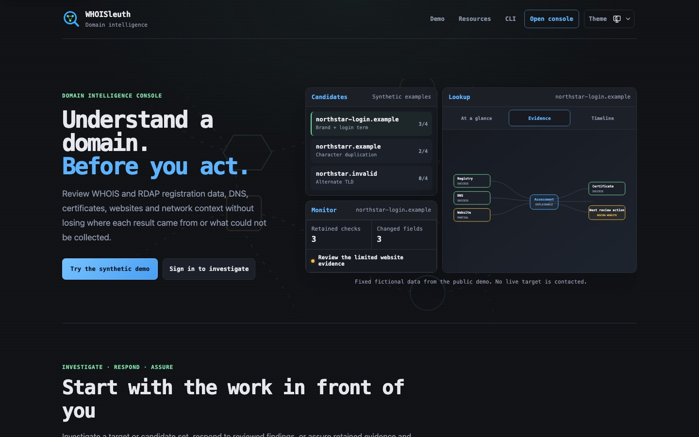

<p align="center"></p>
<h1 align="center">WHOISleuth</h1>

<p align="center">
  
  = 24" />
  
  <a href="https://www.npmjs.com/package/@slicedearth/whoisleuth-cli"></a>
  <a href="https://github.com/slicedearth/whoisleuth/actions/workflows/ci.yml"></a>
  <a href="https://app.netlify.com/projects/whoisleuth/deploys"></a>
</p>

WHOISleuth is a local-first domain intelligence and brand-protection console.
It brings registration, DNS, certificate, website, network, and brand context
into one review workflow without treating an unavailable source as evidence of
absence or safety.

Use it to inspect a domain, IP address, or ASN; discover possible brand
lookalikes; compare a bounded list of domains; document cases; and monitor
material changes. Evidence stays attributed to its source, collection limits
remain visible, and scores remain explainable prioritisation aids rather than
automated verdicts.

<p align="center">
  <a href="https://whoisleuth.com"><strong>View WHOISleuth</strong></a>
  &nbsp;·&nbsp;
  <a href="https://whoisleuth.com/demo"><strong>Explore the synthetic demo</strong></a>
  &nbsp;·&nbsp;
  <a href="https://whoisleuth.com/resources"><strong>Browse investigation resources</strong></a>
</p>

<p align="center">
  <a href="https://whoisleuth.com/demo"></a>
</p>

The demo uses fixed fictional evidence on reserved domains. Its six-stage
progress rail distinguishes the current, completed, available, and upcoming
parts of the workflow. It does not sign in, run live analysis, or write to the
protected Console's investigation data. Its later stages reuse the production
source-map, lifecycle, activity, and evidence-card components with fixed
fixtures. The public Guide maps common goals to the relevant tool and
interpretation sections, while the Privacy page provides local section
navigation without shortening the policy.

## What it does

| Area | Purpose | Important boundary |
| --- | --- | --- |
| **Dashboard** | Start or resume investigations, defensive reviews, comparisons, and case work. | Guided recipes require explicit approval before requests and cannot run arbitrary actions. |
| **Lookup** | Inspect one domain, IP address, or ASN through separately attributed registration, DNS, website, certificate, network, and derived evidence. Deep domain results can compare bounded SOA publication across selected authorities and compare the observed leaf certificate with a generated local SSLBL snapshot. | Deep is the default; Fast is registration-first. Supporting sources never override authoritative availability evidence, direct DNS failures remain inconclusive, and no warning-list miss establishes safety. |
| **Discover** | Generate bounded local lookalikes, review names and issuance groups observed in public certificate logs, or deliberately pivot through one registry's RDAP nameserver-search results. | Registry pivots are suffix-scoped lower bounds. Certificate co-issuance is a review lead, not attribution. Sorting does not change evidence or score. |
| **Bulk** | Compare bounded domain sets with explicit request pacing, source-aware filters, compact Deep evidence, relationships, review actions, and resumable sessions. | One job accepts up to 500 Fast or 50 Deep targets. Each domain is a separate request, and incomplete coverage remains distinct from failure or absence. |
| **Brands** | Define official domains, trusted infrastructure, defensive mail expectations, optional page-identity baselines, reviewed desired posture, a cross-domain posture matrix, portable domain-control passports, control-planning context, transient DMARC/TLS aggregate-report review, and a local inbox for explicitly associated cases. | Public observations, imported reports, desired state, approved change windows, retained comparison points, analyst attestations, and case associations remain separate. The matrix and inbox preserve source states and never infer ownership, control, uptime, or attribution from profile or evidence values. |
| **Monitor** | Retain cases, explicit Brand Profile associations, evidence pins, decisions, response actions, campaigns, watchlists, relationships, and review history. Review a campaign through an explicitly selected Brand Profile scope using bounded rationales derived from retained evidence. | Ordinary workspace state stays in IndexedDB. Deleting a profile does not rewrite a case, so an unmatched opaque association remains visible. Cohort review is transient, keeps incomplete sources explicit, and never establishes ownership or attribution. Response packets and defensive exports require human review and are never submitted automatically. |
| **Registry support** | Inspect fixture-backed parser coverage, access constraints, and the fields attempted by each lookup profile. | Coverage describes support and limitations; it does not decide availability or promise that a source will publish a value. |

The Console can export a versioned workspace archive or an encrypted portable
backup. Encryption protects the downloaded file while locked; the active
IndexedDB workspace remains plaintext and browser-local. Optional hosted
monitoring retains only encrypted compact watchlist state.

Lookup can explicitly export a checksummed source-aware passport for one claim
readiness row. The bounded file keeps stable requirement identifiers, exact
source states, observation time, model versions, and limitations while
excluding raw source payloads, contacts, page values, request paths,
credentials, and signer-authentication claims; the local CLI verifies it
offline.

Case schema 12 retains up to eight exact opaque Brand Profile identifiers
chosen by an analyst. Ordinary case exports, Case report v8 JSON and Markdown,
and workspace archives preserve them. Public CLI case packs clear the
identifiers from both cases and embedded reports and disclose the omission
count; trusted and internal packs preserve them.

Deep Lookup keeps source health and provenance visible while organising long
supporting evidence into a scannable result. Reports, retained facts, website
profiles, acquisition checklists, external pivots, and visual summaries are
analyst-controlled views over already collected evidence. They do not make an
enforcement decision, prove ownership or safety, or silently start another
request.

For field-level behaviour, limits, result states, saved-work semantics, and
complete workflows, use the [application guide](docs/application-guide.md).
The public [Guide](https://whoisleuth.com/guide) is the shortest introduction.

## Design principles

- **Authority-aware conclusions.** Registry evidence controls registration
  decisions. Registrar, website, and provider evidence cannot silently replace
  it.
- **Source health is evidence.** Unsupported, skipped, partial, not found,
  rate-limited, unavailable, inconclusive, and error states remain distinct.
- **Bounded collection.** Requests, responses, redirects, arrays, strings,
  concurrency, caches, browser stores, and exports have explicit limits.
- **Safe outbound networking.** HTTP and TLS collection validate public
  addresses, revalidate redirects, resist DNS rebinding, and avoid private
  network targets.
- **Local-first investigation state.** Cases, evidence pins, analyst decisions,
  response actions, profiles, watchlists, campaigns, shortlist entries, saved
  Bulk sessions, explicit website-profile snapshots, investigation templates,
  and rules use bounded IndexedDB stores in the current browser.
- **Explainable analysis.** Risk, Opportunity, page similarity, relationship,
  technology, and posture findings expose their evidence and limitations.
- **Supplementary visuals.** Charts summarise bounded data already present in
  the page. Accessible source lists and tables remain the complete review
  surfaces.
- **Human-controlled action.** WHOISleuth does not send reports, submit targets,
  run takedowns, or turn a score into an enforcement decision automatically.
  Common analyst-owned edits offer a short tab-memory undo; collection,
  imports, exports, confirmed deletion, and source evidence never do.

## Quick start

Requirements:

- Node.js 24 or later
- npm

Install, build, and start the Express deployment:

```bash
npm install
SITE_PASSWORD=choose-a-password \
SESSION_SECRET=choose-a-separate-random-secret \
SESSION_MAX_AGE_DAYS=7 \
npm start
```

Open `http://localhost:3000` for the public overview or
`http://localhost:3000/login` for the protected Console.

Published CLI releases can run without hosting the application:

```bash
npm exec --yes --ignore-scripts --package=@slicedearth/whoisleuth-cli -- whoisleuth --help
```

`SITE_PASSWORD` is the deployment-wide shared password. `SESSION_SECRET`
should be a separate random value, such as 32 random bytes encoded as hex. The
optional `SESSION_MAX_AGE_DAYS` setting accepts a whole number from 1 to 30 and
defaults to 7. The application has no individual accounts, roles, or selective
session revocation. See the [getting-started guide](docs/getting-started.md) for
local development, verification, browser tests, and CLI usage.

## Architecture

WHOISleuth uses a prerendered SvelteKit frontend and a small Node network
boundary. Shared modules under `lib/` own classification, collection,
validation, normalisation, scoring, and evidence contracts. Thin adapters call
those modules from either:

- `server.mts`, an Express server that also serves `frontend/build/`; or
- TypeScript functions under `netlify/functions/`.

The browser cannot open raw WHOIS TCP sockets. The backend does not keep a
general investigation database. It returns bounded request results, while
deliberate browser actions decide which compact records are retained locally or
exported.

For the full request pipeline, trust boundaries, persistence model, and
deployment parity, see the [architecture orientation](docs/architecture.md).

## Documentation

| Document | Use it for |
| --- | --- |
| [Application guide](docs/application-guide.md) | Tool workflow, Fast and Deep modes, result states, scoring, saved work, guided investigations, and exports. |
| [Getting started](docs/getting-started.md) | Installation, local development, verification commands, browser tests, and CLI entry points. |
| [Release discipline](docs/releasing.md) | Semantic-version selection, manifest checks, protected-branch delivery, tagging, and rollback evidence. |
| [Operations and deployment](docs/operations.md) | Authentication, proxy trust, feature switches, optional providers, rate and operation limits, hosted monitoring, Netlify, and deployment checks. |
| [Architecture orientation](docs/architecture.md) | Components, request flow, outbound trust boundaries, persistence, and deliberate trade-offs. |
| [Registry data contract](docs/registry-data-contract.md) | Normalised RDAP, WHOIS, diagnostics, provenance, and compatibility rules. |
| [Registry compatibility](docs/registry-compatibility.md) | Fixture-backed parser support and separately documented access context. |
| [Browser-local data](docs/browser-local-data.md) | IndexedDB, migration, rollback, capacity, and the separate encryption decision. |
| [External findings and intelligence import](docs/external-findings-import.md) | Strict local findings schema plus bounded STIX 2.1 and MISP previews, source-file digests, exclusions, and explicit case-assertion merge behaviour. |
| [Dependency maintenance](docs/dependency-maintenance.md) | Low-noise updates, human review, and GitHub dependency-graph SPDX export. |
| [CLI guide](docs/cli.md) and [reference](docs/cli-reference.md) | Installation and first-use workflow, plus complete command, terminal, diagnostics, discovery, saved-evidence, optional local capture, output, exit-code, and export contracts. |
| [Engineering case study](docs/engineering-case-study.md) | Constraints, representative decisions, hard problems, and review entry points. |
| [Privacy notice](PRIVACY.md) | Collection, browser storage, optional hosted processing, retention, export, and deletion. |

The public `/guide` route is the shortest user-facing introduction. These
repository documents provide the operator and engineering detail behind it.

## Verification

The main local verification sequence is:

```bash
npm test
npm run typecheck
npm run check
npm run build
npm run architecture:check
npm run cli:package:check
npm run test:e2e:built
git diff --check
npm run dependencies:audit
```

Install Playwright's Chromium build once with `npm run test:e2e:install`.
Additional offline or bounded maintainer checks include:

```bash
npm run schema:inventory
npm run test:coverage
npm run test:properties
npm run test:profile
npm run registry:fixtures
npm run benchmark:technology
npm run technology:fixture-review -- reviewed-input.json
npm run benchmark:workflow
npm run lookup:transport-spike
npm run lookup:transport-qualify
npm run sslbl:status
npm run sslbl:check -- --input=sslblacklist.csv
npm run study:first-use -- --template=desktop
npm run study:first-use -- sessions.json
npm run platform:local-data
npm run release:check
npm run security:codeql
npm run registry:drift
npm run rdap-extensions:drift
npm run deployment:self-check -- https://your-deployment.example
```

`registry:fixtures`, the benchmarks, the reviewed-fixture tool, the first-use
study template and aggregator, the local SSLBL snapshot check, the transport
checks, and the local-data evaluation are
deterministic offline checks. The transport qualification suite exercises
buffering, cancellation, slow consumers, authentication expiry, duplicate
events, timeouts, and final-response equivalence without enabling response
streaming in any deployed adapter.
The registry-drift and deployment checks make only their documented, fixed,
bounded network requests. The RDAP extension audit is offline by default; its
explicit `--live` mode makes one bounded request to the fixed official registry
URL. Automated unit and browser tests use deterministic fixtures and do not
query live registries, domains, or providers.

## Deployment summary

Netlify reads `netlify.toml`, builds the static frontend, and packages the
TypeScript functions. Before the first production deployment, set
`SITE_PASSWORD` and a separate `SESSION_SECRET`. Optional providers, distributed
operation controls, and encrypted scheduled monitoring remain disabled unless
their complete configurations are supplied. The existing Netlify or Express
buffered Lookup remains the only production contract.

Read [operations and deployment](docs/operations.md) before exposing a
deployment publicly. It documents the shared-login boundary, reverse-proxy
trust, feature switches, optional credentials, fail-closed states, limits, and
post-deployment checks.

## Licence, attribution, and responsible use

WHOISleuth is licensed under the [GNU Affero General Public License version 3
only](LICENSE) (`AGPL-3.0-only`). Commercial use is permitted, but an operator
that modifies WHOISleuth and makes that version available over a network must
offer the corresponding source under the AGPL. Existing versions previously
released under Apache License 2.0 remain available under the licence supplied
with those versions. Third-party packages, services, and data retain their own
licences and terms.

The [trademark policy](TRADEMARKS.md) covers the WHOISleuth name and logo
separately from the source licence. Copyright and attribution details are in
[NOTICE](NOTICE). The generated
[third-party production notices](frontend/static/third-party-notices.txt)
retain the exact locked package inventory and the licence documents distributed
with those packages.

The software is provided **as is, without warranty**. Registration data can be
redacted, stale, incomplete, or parsed imperfectly. Scores and generated
candidates require analyst review. Use collection, contact data, and report
drafts only where you have a legitimate purpose and comply with applicable
registry terms, privacy law, anti-spam law, and authorisation boundaries.
The [dual-use disclosure](DISCLOSURE) defines the supported defensive scope and
the capability boundaries deliberately excluded from WHOISleuth.

See [PRIVACY.md](PRIVACY.md) for data handling and deletion guidance. Review
and adapt that notice before sharing your own deployment. Report suspected
vulnerabilities privately through the [security policy](SECURITY.md).

## Project structure

```text
server.mts              Express, authentication, API, and static-site adapter
lib/                    Shared bounded collection and analysis modules
netlify/functions/      Thin Netlify adapters and optional scheduled worker
frontend/               Prerendered SvelteKit public site and protected Console
bin/ and cli/            First-party command-line interface
fixtures/               Sanitised deterministic registry fixtures
test/ and e2e/           Unit, integration, and browser verification
tools/                  Maintainer checks and offline evaluation commands
docs/                   User, operator, architecture, contract, and CLI guides
```

The generated `frontend/build/` output is ignored. Both deployment adapters
serve the same frontend and call the same shared intelligence modules.
