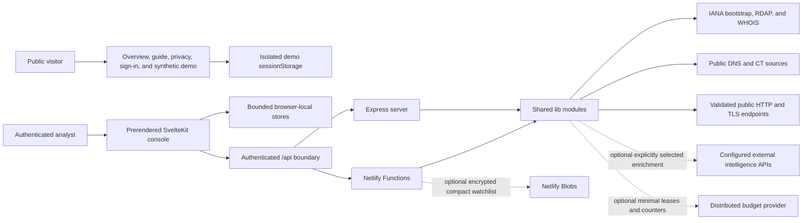
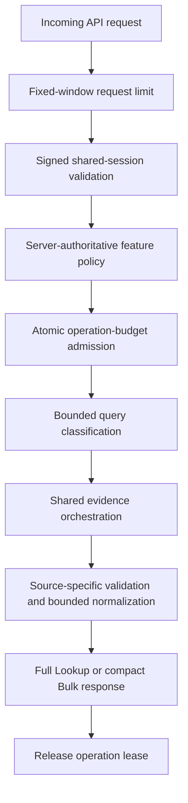
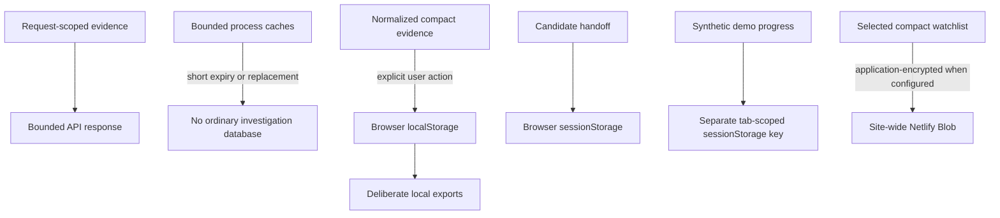

# Architecture Orientation

WHOISleuth is a privacy-conscious domain-intelligence workbench with a static
multi-page browser interface and a small hosted network boundary. It can run on
one long-lived Express process or as independently invoked Netlify Functions;
both runtimes call the same modules under `lib/` so registry parsing, request
validation, feature policy, and evidence contracts do not fork by deployment.

This document explains the major components, trust boundaries, request path,
storage model, and deliberate trade-offs. Detailed normalized registry shapes
and compatibility fields live in the
[registry data contract](registry-data-contract.md). Personal-data flows and
retention are covered by [the privacy notice](../PRIVACY.md).

## System context

The browser never opens raw WHOIS sockets or bypasses the API to perform hosted
evidence collection. The backend never owns analyst projects or a general
investigation database. It returns bounded results for the current request;
deliberate browser actions decide what compact evidence is retained locally or
exported. When explicitly configured, the scheduled worker stores one bounded,
application-encrypted compact watchlist projection rather than ordinary cases,
profiles, notes, raw registry payloads, or deep website evidence.

## Component responsibilities

| Layer | Owns | Does not own |
| --- | --- | --- |
| `frontend/src/routes/` | Public overview, demo, guide, sign-in, and privacy pages plus the protected Dashboard, Lookup, Discover, Bulk, Monitor, Brands, and Registry support interfaces. | Registry protocol logic, authentication enforcement, outbound-request trust decisions, or deployment-wide budgets. |
| `frontend/src/lib/analysis/` | Pure scoring, candidate generation, comparison, typed investigation projection, relationship, history, report, and normalization models that can be tested without the DOM. | Direct network access or browser storage. |
| Browser-store wrappers in `frontend/src/lib/` | Versioned access to Brand Profiles, watchlists, cases, campaigns, CT history, shortlist, and cross-tool handoff state. | General server persistence, cross-device synchronization, accounts, or a general background-job system. |
| `server.mts` and `netlify/functions/` | HTTP entry points, authentication, request throttling, feature enforcement, operation admission, response shaping, and the optional Netlify scheduled-watchlist boundary. | Separate copies of lookup and parsing rules. |
| `lib/` | Query classification, RDAP bootstrap/failover, WHOIS referral chains, availability, DNS/HTTP/page/TLS intelligence, CT search, security.txt collection, optional external intelligence adapters, derived technology and passive-posture analysis, observed network context, security boundaries, capability reporting, and operation budgets. | User interface state or analyst decisions. |
| Optional distributed budget provider | Opaque expiring leases and bounded operation counters when explicitly configured. | Query targets, responses, evidence, notes, profiles, or session tokens. |
| Optional Netlify Blob store | One application-encrypted, bounded compact scheduled-watchlist envelope when explicitly configured. | Raw RDAP/WHOIS, expanded contacts, analyst notes, sessions, Brand Profiles, cases, or deep website evidence. |

## Protected request pipeline

Express middleware and the Netlify network guard enforce equivalent boundaries
before shared lookup code runs:

The frontend capability report mirrors server policy so controls can explain a
disabled or unavailable source, but the browser is never the enforcement
boundary. Direct function URLs repeat authentication, feature, rate, and
operation-budget checks rather than relying only on canonical-path rewrites.

### Fast and deep scans

Fast and deep modes are execution profiles, not confidence labels:

| Profile | Intended use | Hosted work |
| --- | --- | --- |
| **Fast** | High-volume candidate triage. | RDAP-led registration analysis, with bounded authoritative DNS delegation fallback where needed. WHOIS and deep website/TLS evidence are skipped explicitly. |
| **Deep** | Single-target investigation and analyst-selected richer Bulk or CLI evidence. | RDAP plus bounded registrar RDAP follow-up, WHOIS, availability, DNS, HTTP, favicon, page identity, one-connection TLS, derived technology and passive-posture findings, and one observed-address IP RDAP context. Optional security.txt and external provider actions run only when explicitly selected. |

Bulk uses the same `/api/lookup` orchestration one domain at a time and requests
a compact response that omits raw RDAP JSON and multi-hop WHOIS bodies. This
keeps each serverless invocation bounded and avoids downloading large source
payloads that Bulk does not display or retain.

## Outbound evidence boundaries

- **RDAP** starts from validated IANA bootstrap data, prefers HTTPS, validates
  successful objects against the requested domain/IP/ASN, and records bounded
  endpoint-attempt diagnostics. A stale validated bootstrap can bridge a
  temporary bootstrap outage.
- **WHOIS** follows a bounded TCP/43 referral chain with validated public
  targets, per-hop attempt caps, one overall deadline, incremental decoding,
  and source-aware authority analysis. Positive registry evidence is not
  overturned by a contradictory or failed later referral.
- **HTTP** resolves a hostname once, rejects private and special-purpose
  addresses, pins the actual connection to validated public addresses, validates
  every redirect, caps redirects and retained body bytes, and closes its
  per-request dispatcher. The homepage, favicon, optional security.txt file,
  and owned-domain policy requests reuse these trust controls with their own
  bounded contracts.
- **TLS** resolves through the public-address guard and opens one pinned
  connection while retaining the hostname for SNI and hostname validation. It
  stores bounded public certificate metadata rather than certificate bytes or
  session material.
- **DNS and Certificate Transparency** retain only the records or structured
  public-log provenance needed for the requested feature, with explicit row,
  string, hostname, and response-size caps.
- **External intelligence** is disabled until configured and runs only when a
  user selects the corresponding deep action. Each adapter sends a bounded
  canonical domain under its declared policy, retains no provider cache, and
  keeps provider misses or outages neutral.

Source health is part of the result contract. Unsupported, skipped, partial,
not-found, and failed collection remain distinct so missing data is not silently
converted into a negative security or availability conclusion.

## Data ownership and persistence

The local stores are versioned, normalized on read, bounded by record and field
counts, and—where evidence volume is material—protected by serialized byte
budgets and deterministic pruning. They remain ordinary browser storage rather
than encryption. Clearing site data removes them, and another device or browser
profile does not receive them automatically.

Registry bootstrap data and selected upstream results can use bounded,
short-lived process caches to reduce duplicate requests; they are not an
analyst investigation store. Optional hosted monitoring is a separate,
Netlify-only persistence path. It retains one encrypted compact projection with
bounded history and a resumable cursor so scheduled fast checks can continue.
Because the deployment uses one shared login, every signed-in person can manage
that same hosted projection when the feature is enabled.

`investigation-projection.ts` provides a separate read-only view over current
case, campaign, Brand Profile, page-baseline, and explicitly supplied scan-local
relationship contracts. It revalidates each source, refuses newer schemas, and
emits bounded typed entities, observations, and provenance-backed relationships
without mutating or migrating a store. Compact case evidence keeps completeness
and truncation unknown when its source-health envelope was not retained; the
projection never fills that gap by inference.

`investigation-search.ts` builds a second bounded, disposable index over that
projection. The browser adapter reads the existing case, campaign, and Brand
Profile stores within their established byte limits, then discards the index
when the page is left. Search is restricted to known entity fields, returns at
most 50 deterministically ranked matches, carries source completeness and
truncation into every result, and performs no provider request or persisted
write. Result links are passive pivots into the exact retained case, campaign,
or Brand Profile where one exists.

The independent browser-store ceilings now total 9.75 MiB, which is greater
than the 5 MiB localStorage planning reference used by the case model. The
maintainer-run `npm run platform:local-data` command derives that total from the
owning constants without reading user data. The resulting architecture
evaluation recommends a dependency-free native IndexedDB prototype, but does
not change the current storage authority or approve a migration. The temporary
browser probe uses only fixed synthetic records and deletes its database after
testing. Production migration, encryption, PWA support, and synchronization
remain separate decisions documented in
[the browser-local data architecture](browser-local-data.md).

The public demo has a separate fixed schema and storage key. It uses reserved
domains, does not call analysis APIs, cannot read or write production
investigation stores, and marks every downloaded package as synthetic. The
public layout's ordinary theme preference and boolean session-status check
remain separate from demo progress.

## Authentication and operation controls

The protected console uses one deployment-wide password and stateless signed
cookies. This intentionally avoids an account database, but it also means there
are no individual identities, roles, per-user audit trails, or server-side
revocation list. Rotating the independent session secret invalidates all active
sessions.

Network-heavy operations receive both a concurrency class and a versioned
feature identity. The zero-configuration provider holds leases in one process
or warm serverless instance. An optional HTTPS REST provider can make leases and
configured fixed-window usage ceilings deployment-wide without receiving query
or evidence content. Provider failures fail closed when distributed enforcement
is configured.

Emergency feature switches are evaluated at the server boundary. Disabling one
source produces explicit skipped/disabled evidence and prevents a partial deep
scan from overwriting previously retained deep-only observations as though they
had disappeared.

## Deployment parity

`npm run build` prerenders independent static entries for each tool. The
same output can be served by Express or published directly by Netlify. Express
maps API routes in one process; Netlify uses thin function wrappers and path
rewrites. Both import the same `lib/` orchestration and use compatible response
shapes. The encrypted scheduled-watchlist worker and Blob management path are
optional Netlify capabilities rather than an Express parity claim.

The parity boundary is verified at shared modules and HTTP wrappers rather than
through duplicated business logic. Platform-specific limitations remain
visible: without the optional distributed provider, Express budgets are
process-local and Netlify budgets are warm-instance-local and reset on cold
starts.

## Verification strategy

The test pyramid is designed to avoid dependence on public services:

1. Node tests exercise pure normalization, parsing, security boundaries,
   migrations, scoring, comparison, storage budgets, and injected transport
   behavior with deterministic fixtures.
2. TypeScript checks cover native backend contracts, frontend analysis helpers,
   and Playwright specifications; Svelte checks validate route components.
3. The production Svelte build proves every prerendered page can be emitted.
4. Chromium Playwright tests cover authentication, responsive and accessible
   workflows, browser storage and downloads, API isolation, and the public
   synthetic demo against a local production-style server.
5. CI runs the locked install, production dependency audit, and complete
   verification sequence for pushes and pull requests, retaining browser
   artifacts only on failure.

The on-demand `npm run schema:inventory` report is assembled from the owning
contract constants and readers rather than a copied version table. Its explicit
supported-version lists make a contract bump fail tests until legacy handling,
future-version behavior, byte bounds, migration direction, and write semantics
are reviewed.
It reads no browser-local or hosted records and writes no inventory artifact.

The maintainer-run `npm run registry:drift` audit compares the embedded
registry-standards snapshot with exactly two fixed official IANA catalogue
files: the root-zone TLD list and the domain RDAP bootstrap. Its versioned
report caps response bytes, parsed records, deadlines, and reported suffix
differences. It does not accept a target, query a registry, test live domain
reachability, update the catalogue, or interpret drift as registration,
availability, ownership, safety, or maliciousness evidence. Automated tests
exercise only injected fixtures; running the command is an explicit manual
network operation. The read-only `registry-drift.yml` workflow also runs the
same command weekly or on explicit dispatch with locked dependencies, no
secrets, no write permissions, and a ten-minute job deadline. A non-current
result retains its versioned JSON report for seven days and fails the workflow
for manual review; it does not modify the catalogue, open issues, or notify an
external service.

Browser tests use reserved or locally rejected inputs and actively block
off-origin requests, so ordinary verification does not query live registries,
DNS, Certificate Transparency, or websites.

## Deliberate trade-offs

- **Shared password over accounts:** smaller operational and privacy surface;
  no individual authorization or accountability.
- **Browser-local investigations over a database:** no hosted evidence store or
  account synchronization. An optional bounded worker can rescan one encrypted
  compact watchlist projection, but it is not a general job or cross-device
  investigation system.
- **Fast/deep profiles over one maximal scan:** predictable bulk cost and clear
  provenance; analysts must choose when richer evidence justifies more work.
- **Exact and component-level relationships over ownership inference:**
  explainable pivots with fewer claims; correlation still requires human
  interpretation.
- **Two thin deployment adapters over platform-specific implementations:**
  one behavior contract; platform execution limits and local-only controls must
  still be disclosed honestly.
- **Synthetic public demo over live public lookup access:** portfolio and product
  exploration without exposing the protected console or spending hosted
  evidence budgets.

These constraints are part of the product design, not unfinished abstractions.
Features such as accounts, general scheduled jobs, server-side projects,
automatic notifications, and heavier browser rendering require an explicit
change to the security, privacy, cost, and persistence model rather than an
isolated UI addition.
