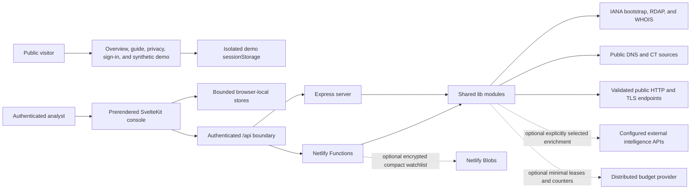
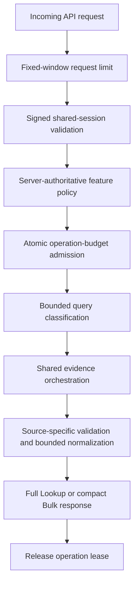
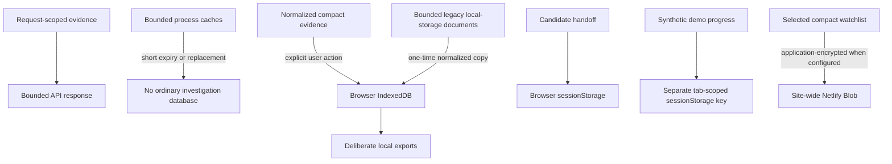

# Architecture Orientation

WHOISleuth is a privacy-conscious domain-intelligence workbench with a static
multi-page browser interface and a small hosted network boundary. It can run on
one long-lived Express process or as independently invoked Netlify Functions;
both runtimes call the same modules under `lib/` so registry parsing, request
validation, feature policy, and evidence contracts do not fork by deployment.

This document explains the major components, trust boundaries, request path,
storage model, and deliberate trade-offs. Detailed normalised registry shapes
and compatibility fields live in the
[registry data contract](registry-data-contract.md). Personal-data flows and
retention are covered by [the privacy notice](../PRIVACY.md).

## System context

```mermaid
flowchart LR
  visitor["Public visitor"] --> public["Overview, guide, privacy, sign-in, and synthetic demo"]
  analyst["Authenticated analyst"] --> ui["Prerendered SvelteKit console"]

  public --> tab["Isolated demo sessionStorage"]
  ui --> local["Bounded browser-local stores"]
  ui --> api["Authenticated /api boundary"]

  api --> express["Express server"]
  api --> functions["Netlify Functions"]
  express --> shared["Shared lib modules"]
  functions --> shared

  shared --> registry["IANA bootstrap, RDAP, and WHOIS"]
  shared --> dns["Public DNS and CT sources"]
  shared --> web["Validated public HTTP and TLS endpoints"]
  shared -. "optional explicitly selected enrichment" .-> intel["Configured external intelligence APIs"]
  shared -. "optional minimal leases and counters" .-> budget["Distributed budget provider"]
  functions -. "optional encrypted compact watchlist" .-> blobs["Netlify Blobs"]
```

The browser never opens raw WHOIS sockets or bypasses the API to perform hosted
evidence collection. The backend never owns analyst projects or a general
investigation database. It returns bounded results for the current request;
deliberate browser actions decide what compact evidence is retained locally or
exported. When explicitly configured, the scheduled worker stores one bounded,
application-encrypted compact watchlist projection rather than ordinary cases,
profiles, notes, raw registry payloads, or deep website evidence.

## Component responsibilities

| Layer | Owns | Does not own |
| --- | --- | --- |
| `frontend/src/routes/` | Public overview, demo, guide, sign-in, and privacy pages plus the protected Dashboard, Lookup, Discover, Bulk, Monitor, Brands, and Registry support interfaces. | Registry protocol logic, authentication enforcement, outbound-request trust decisions, or deployment-wide budgets. |
| `frontend/src/lib/analysis/` | Framework-neutral scoring, candidate generation, comparison, typed investigation projection, relationship, history, report, and normalisation models shared by browser, CLI, and server-side consumers. The historical path is not a frontend-only ownership boundary. | DOM APIs, direct network access, or browser storage. |
| Browser-store wrappers in `frontend/src/lib/` | Versioned access to Brand Profiles, watchlists, cases, campaigns, CT history, shortlist, custom rules, and analyst-selected relationship observations. | General server persistence, cross-device synchronisation, accounts, or a general background-job system. |
| `server.mts` and `netlify/functions/` | HTTP entry points, authentication, request throttling, feature enforcement, operation admission, response shaping, and the optional Netlify scheduled-watchlist boundary. | Separate copies of lookup and parsing rules. |
| `lib/` | Query classification, RDAP bootstrap/failover, WHOIS referral chains, availability, DNS/HTTP/page/TLS intelligence, CT search, security.txt collection, optional external intelligence adapters, bounded structured identity, derived technology and response-policy/passive-posture analysis, observed network context, security boundaries, capability reporting, and operation budgets. | User interface state or analyst decisions. |
| Optional distributed budget provider | Opaque expiring leases and bounded operation counters when explicitly configured. | Query targets, responses, evidence, notes, profiles, or session tokens. |
| Optional Netlify Blob store | One application-encrypted, bounded compact scheduled-watchlist envelope when explicitly configured. | Raw RDAP/WHOIS, expanded contacts, analyst notes, sessions, Brand Profiles, cases, or deep website evidence. |

## Protected request pipeline

Express middleware and the Netlify network guard enforce equivalent boundaries
before shared lookup code runs:

```mermaid
flowchart TD
  request["Incoming API request"] --> limit["Fixed-window request limit"]
  limit --> auth["Signed shared-session validation"]
  auth --> policy["Server-authoritative feature policy"]
  policy --> admission["Atomic operation-budget admission"]
  admission --> classify["Bounded query classification"]
  classify --> orchestrate["Shared evidence orchestration"]
  orchestrate --> normalize["Source-specific validation and bounded normalization"]
  normalize --> response["Full Lookup or compact Bulk response"]
  response --> release["Release operation lease"]
```

The frontend capability report mirrors server policy so controls can explain a
disabled or unavailable source, but the browser is never the enforcement
boundary. Direct function URLs repeat authentication, feature, rate, and
operation-budget checks rather than relying only on canonical-path rewrites.

### Fast and deep scans

Fast and deep modes are execution profiles, not confidence labels:

| Profile | Intended use | Hosted work |
| --- | --- | --- |
| **Fast** | High-volume candidate triage. | RDAP-led registration analysis, with bounded authoritative DNS delegation fallback where needed. WHOIS and deep website/TLS evidence are skipped explicitly. |
| **Deep, full** | Single-target Lookup and full CLI investigation. | RDAP plus bounded registrar RDAP follow-up, WHOIS, availability, DNS with domain SOA or public-IP PTR context, HTTP, favicon, page identity, privacy-minimised credential-surface counts, publisher-declared structured identity, one-connection TLS, derived technology and passive-posture findings, and one observed-address IP RDAP context. Optional security.txt and external provider actions run only when explicitly selected. |
| **Deep, compact** | Analyst-selected richer Bulk triage. | RDAP, WHOIS, availability, DNS, bounded website evidence, TLS evidence, up to 12 normalised technology identifiers, a bounded TLS issuer label, and an SPKI SHA-256 fingerprint needed by the compact result. Registrar RDAP follow-up, raw registry payloads, structured-identity, rich technology and passive-posture detail, the full certificate profile, observed-address IP RDAP, security.txt, and external providers remain omitted. |

Bulk uses the same `/api/lookup` orchestration one domain at a time and requests
a compact response. The compact profile does not collect omitted full-lookup
sources and excludes raw RDAP JSON and multi-hop WHOIS bodies from its response.
This keeps each serverless invocation bounded and avoids work and payloads that
Bulk does not display or retain.

Deep full Lookup keeps one authoritative HTTP response rather than splitting
registration and enrichment into separate requests or depending on
deployment-specific response streaming. The browser displays elapsed time and
eligible branches as pending until that response arrives. It can stop waiting
after an analyst cancellation, navigation away, or its 40-second deadline, but
already-admitted server work remains bounded by the existing operation lease
and source deadlines.

Polling was not selected because it would require durable job state or risk
repeating upstream work. Split registration and enrichment responses would
change cache and request-budget semantics and could expose an assessment before
all authority inputs settle. Response streaming is not the shared contract of
the current Express, static-frontend, and serverless adapters. The selected
single-response design therefore improves progress and cancellation feedback
without introducing a second orchestration path.

The repository also contains deterministic offline transport and qualification
tools for evaluating a possible future incremental contract. Source updates are
explicitly non-persistable, and only a validated final Lookup envelope may
become a result. The qualification suite covers chunking, proxy buffering,
abort cancellation, a deliberately slow consumer, authentication expiry,
duplicate events, timeout handling, and exact final-envelope equivalence.
These are synthetic protocol checks. Neither Express nor Netlify exposes an
incremental route, so no core deployment adapter is production-qualified for
streaming.

Diagnostics version 8 adds bounded settle timing and the optional separately
attributed reverse-DNS diagnostic only to deep non-compact responses. Each
recorded branch has a fulfilled or rejected promise outcome, duration, and
completion offset relative to the unified request. These are orchestration
measurements, not evidence-health claims: a fulfilled branch can still return
partial, unavailable, not-found, or error evidence. Branches overlap and their
durations must not be summed. Fast and compact responses retain diagnostics
version 7 and their existing payload shape.

## Outbound evidence boundaries

- **RDAP** starts from validated IANA bootstrap data, prefers HTTPS, validates
  successful objects against the requested domain/IP/ASN, and records bounded
  endpoint-attempt diagnostics. A stale validated bootstrap can bridge a
  temporary bootstrap outage. Discover can separately request one RFC 9082
  nameserver search from the IANA-selected service for an analyst-supplied
  registry suffix. That explicit action retains at most 200 normalised
  in-scope domains, is never part of Fast, Compact, Deep, or monitoring, and
  remains a registry-scoped lower bound rather than a global reverse pivot.
- **WHOIS** follows a bounded TCP/43 referral chain with validated public
  targets, per-hop attempt caps, one overall deadline, incremental decoding,
  and source-aware authority analysis. Positive registry evidence is not
  overturned by a contradictory or failed later referral.
- **HTTP** resolves a hostname once, rejects private and special-purpose
  addresses, rejects a resolution with more than 64 address candidates, pins
  the actual connection to validated public addresses, validates every
  redirect, reapplies the address bound at each hop, caps redirects and retained
  body bytes, and closes its per-request dispatcher. The homepage, favicon,
  optional security.txt file, and owned-domain policy requests reuse these trust
  controls with their own bounded contracts. Deep full Lookup can transiently reduce selected CSP,
  HSTS, referrer-policy, and response-cookie attributes from the chosen
  homepage response to fixed posture signals and bounded counts. Complete
  values and cookie identifiers are discarded, and the signals do not affect
  availability or Risk.
- **TLS** resolves through the public-address guard and opens one pinned
  connection while retaining the hostname for SNI and hostname validation. It
  stores bounded public certificate metadata rather than certificate bytes or
  session material.
- **DNS and Certificate Transparency** retain only the records or structured
  public-log provenance needed for the requested feature, with explicit row,
  string, hostname, and response-size caps. Domain SOA and public-IP PTR
  collection run only in deep non-compact Lookup. PTR names remain
  non-authoritative context.
- **External intelligence** is disabled until configured and runs only when a
  user selects the corresponding deep action. Each adapter sends a bounded
  canonical domain under its declared policy, retains no provider cache, and
  keeps provider misses or outages neutral.

Source health is part of the result contract. Unsupported, skipped, partial,
not-found, and failed collection remain distinct so missing data is not silently
converted into a negative security or availability conclusion.

## Data ownership and persistence

```mermaid
flowchart TB
  transient["Request-scoped evidence"] --> response["Bounded API response"]
  upstreamCache["Bounded process caches"] -->|"short expiry or replacement"| expiry["No ordinary investigation database"]
  compact["Normalized compact evidence"] -->|"explicit user action"| stores["Browser IndexedDB"]
  legacy["Bounded legacy local-storage documents"] -->|"one-time normalized copy"| stores
  handoff["Candidate handoff"] --> session["Browser sessionStorage"]
  demo["Synthetic demo progress"] --> demoStore["Separate tab-scoped sessionStorage key"]
  stores --> export["Deliberate local exports"]
  scheduled["Selected compact watchlist"] -->|"application-encrypted when configured"| blob["Site-wide Netlify Blob"]
```

The local stores are versioned, normalised on read, bounded by record and field
counts, and protected by serialised byte budgets and deterministic pruning
where evidence volume is material. The dependency-free provider stores keyed
records and collection manifests in IndexedDB and supports atomic
multi-collection updates. A one-time migration normalises supported legacy
local-storage documents, verifies the committed record digests, and keeps the
legacy source untouched. Later IndexedDB writes are authoritative; a deliberate
Dashboard action can refresh the legacy compatibility copy before a rollback.
These records remain ordinary plaintext browser storage rather than
application-encrypted data. Clearing site data removes them, and another device
or browser profile does not receive them automatically.

Registry bootstrap data and selected upstream results can use bounded,
short-lived process caches to reduce duplicate requests; they are not an
analyst investigation store. Optional hosted monitoring is a separate,
Netlify-only persistence path. It retains one encrypted compact projection with
bounded history and a resumable cursor so scheduled fast checks can continue.
Because the deployment uses one shared login, every signed-in person can manage
that same hosted projection when the feature is enabled.

`investigation-projection.ts` provides a separate read-only view over current
case, campaign, Brand Profile, page-baseline, explicitly supplied scan-local
relationship contracts, and relationship observations retained through an
analyst action. It revalidates each source, refuses newer schemas, and emits
bounded typed entities, observations, and provenance-backed relationships
without mutating or migrating a store. Compact case evidence keeps completeness
and truncation unknown when its source-health envelope was not retained; the
projection never fills that gap by inference.

`investigation-search.ts` builds a second bounded, disposable index over that
projection. The browser adapter reads the existing case, campaign, Brand
Profile, and relationship-observation stores within their established byte
limits, then discards the index when the page is left. Search is restricted to
known entity fields, returns at most 50 deterministically ranked matches,
carries source completeness and truncation into every result, and performs no
provider request or persisted write. Result links are passive pivots into the
exact retained case, campaign, Brand Profile, or relationship observation where
one exists.

`campaign-cohort-review.ts` is a separate transient campaign projection. It
requires an analyst-selected exact Brand Profile identifier already present in
Case schema 12 associations, scopes at most 50 campaign cases, and reuses the
existing source-aware relationship summary. Cohort connectivity can use only
four typed rationales: exact retained relationships, bounded similarity,
pairwise same-registrar creation-publication observations within seven days,
and catalogue-qualified common infrastructure. It emits at most 25 cohorts,
100 rationales, and 100 separately displayed assertions. Assertions never feed
membership, identifiers, ordering, or counts. The projection creates no store,
schema, export, request, score, ownership inference, or attribution decision.
Unavailable source collections remain explicit rather than becoming empty or
negative evidence.

The Case model and the existing Monitor Case API are the sole mutation owners
for Case schema 12's bounded `brandProfileIds` field. The Brands route reads
that field only to project existing source-aware analyst review rows for the
active profile; it cannot add, remove, resolve, or rewrite an association.
Monitor expresses UI changes as retry-safe add or remove intents so every
browser-local conflict retry derives from the latest Case and preserves an
unrelated tab's change. Exact profile-identifier reuse for a different
normalised name rejects the Brand Profile merge and any dependent workspace
Case section atomically.
Profile deletion therefore never cascades. Unmatched identifiers remain
source-qualified local state rather than new relationship, graph, packet,
capsule, calibration, or reverse-reference edges.

The 12 independent browser-store ceilings total 15.75 MiB, which is greater than
the 5 MiB local-storage planning reference used by the former design. The
maintainer-run `npm run platform:local-data` command derives that total from the
owning constants without reading user data. The native provider preserves those
application bounds while removing the single-origin local-storage capacity
assumption. Browser tests use only fixed synthetic records and isolate their
database state. Portable workspace archives can be wrapped in browser-local
passphrase-based authenticated encryption. The active IndexedDB codec remains
plaintext, while a live encrypted vault, PWA support, and synchronisation
remain separate decisions documented in
[the browser-local data architecture](browser-local-data.md).

The public demo has a separate fixed schema and storage key. It uses reserved
domains, does not call analysis APIs, cannot read or write production
investigation stores, and marks every downloaded package as synthetic. The
public layout's ordinary theme preference and boolean session-status check
remain separate from demo progress.

## Authentication and operation controls

The protected console uses one deployment-wide password and stateless signed
cookies. This intentionally avoids an account database, but it also means there
are no individual identities, roles, per-user audit trails, or server-side
revocation list. Rotating the independent session secret invalidates all active
sessions.

Network-heavy operations receive both a concurrency class and a versioned
feature identity. The zero-configuration provider holds leases in one process
or warm serverless instance. An optional HTTPS REST provider can make leases and
configured fixed-window usage ceilings deployment-wide without receiving query
or evidence content. Provider failures fail closed when distributed enforcement
is configured.

Emergency feature switches are evaluated at the server boundary. Disabling one
source produces explicit skipped/disabled evidence and prevents a partial deep
scan from overwriting previously retained deep-only observations as though they
had disappeared.

## Deployment parity

`npm run build` prerenders independent static entries for each tool. The
same output can be served by Express or published directly by Netlify. Express
maps API routes in one process; Netlify uses thin function wrappers and path
rewrites. Both import the same `lib/` orchestration and use compatible response
shapes. The encrypted scheduled-watchlist worker and Blob management path are
optional Netlify capabilities rather than an Express parity claim.

The parity boundary is verified at shared modules and HTTP wrappers rather than
through duplicated business logic. Platform-specific limitations remain
visible: without the optional distributed provider, Express budgets are
process-local and Netlify budgets are warm-instance-local and reset on cold
starts.

Protected-route loading has two separate local checks. The static manifest
report measures each route's production asset closure and fails if the
browser-local workspace chunk enters a public route. The authenticated
Playwright baseline cold-loads Lookup and Monitor through the local session
boundary, records encoded transfer bytes, first enabled route-control time,
paint and navigation milestones, and Chromium long-task cost, and applies broad
regression ceilings. These local measurements are repeatable build tripwires,
not claims about production latency, mobile hardware, proxy behaviour, or a
particular visitor's experience.

## Common-infrastructure catalogue

Evidence-cluster review can qualify an exact retained IP relationship against a
checked-in Common-infrastructure snapshot. The maintenance command
`npm run common-infrastructure:update -- --commit <full-sha>` reads only a
pinned MISP warning-lists commit, caps every source response at 1 MiB, accepts
only exact CIDR lists, rejects malformed or duplicate entries before applying
freshness policy, and caps the generated snapshot at 20,000 entries and 1 MiB.
A fully valid source older than 30 days is retained only as an explicit stale
exclusion and contributes no ranges; malformed or unavailable required sources
still fail the update. Active and excluded source IDs must form the exact
reviewed four-source partition. The retained snapshot records the upstream
commit, source date, SHA-256 digest, licence, exclusions, and limitations.

Runtime matching is browser-local and makes no provider request. A match only
qualifies the relationship as shared infrastructure. It does not identify an
origin host, tenant, account, operator, ownership, intent, safety, or
maliciousness. A non-match is inconclusive. Stale or oversized sources are
excluded rather than silently treated as current.

## Bounded local analysis dependencies

Browser-local saved-work search uses a bounded in-memory candidate index and
then applies the existing deterministic exact, prefix, boundary, and substring
ranker. Fuzzy expansion is not enabled. The CLI's one-shot archive search keeps
its exact allowlisted-field traversal because constructing a persistent browser
index provides no benefit for a single offline query; both paths remain local,
bounded, and redacted by default.

Relationship clustering uses a shared bounded graph-analysis module for
connected components and review paths. D3 remains presentation-only, and graph
structure never becomes an ownership, coordination, intent, safety, or
maliciousness conclusion. The same exported relationship evidence remains
portable even where the CLI does not render the interactive browser view.

TLS observations use Node's native certificate API for identity, validity,
fingerprint, public-key, SAN, purpose, signature, and AIA evidence. A narrow
supplemental parser reads only certificate-policy OIDs and CRL-distribution
scheme counts that the native API does not expose. It retains neither raw
certificate bytes nor distribution locations and fails soft on malformed
extensions.

Optional MMDB enrichment is CLI-only because hosted and browser deployments
cannot open an analyst's local database. It requires an explicit local file and
source, version, and licence metadata, performs no download or transmission,
and emits the same bounded GeoIP evidence fields as the JSON-prefix review path.

## Verification strategy

The offline conformance suite includes an independent RDAP response fixture
from the permissively licensed ICANN reference implementation and validates
WHOISleuth's two STIX export families against pinned OASIS STIX 2.1 JSON
schemas. These are development oracles, not production dependencies, live
registry tests, or claims of complete semantic interoperability.

The test pyramid is designed to avoid dependence on public services:

1. Node tests exercise pure normalisation, parsing, security boundaries,
   migrations, scoring, comparison, storage budgets, and injected transport
   behaviour with deterministic fixtures.
2. Strict TypeScript checks cover native backend contracts, tools, the CLI,
   Node tests, frontend analysis helpers, Playwright specifications, and the
   pre-render theme bootstrap; Svelte checks validate route components.
3. The production Svelte build proves every prerendered page can be emitted.
4. Chromium Playwright tests cover authentication, responsive and accessible
   workflows, browser storage and downloads, API isolation, and the public
   synthetic demo against a local production-style server.
5. CI runs the locked install, production dependency audit, and complete
   verification sequence for pushes and pull requests, retaining bounded
   coverage and browser-result summaries plus failure-only traces and
   screenshots. Scheduled property and duration profiles provide deeper test
   health evidence without live collection.

### Enforced dependency boundaries

`npm run architecture:check` validates the application dependency graph during
local verification and CI. It rejects circular dependencies, prevents browser
modules from reaching server networking, authentication, secret, filesystem,
CLI, or function code, and requires optional intelligence adapters to import the
provider-neutral contract directly.

Framework-neutral models currently live under `frontend/src/lib/analysis/`
because the browser was their first consumer. Server and CLI imports from that
directory are deliberate; the enforced direction is that these modules stay
pure and never acquire DOM, storage, credential, filesystem, or network
dependencies. Moving them solely to rename the directory would create broad
import churn without changing the trust boundary.

Optional active local packages remain separate from the core CLI and hosted
adapters. The dependency rule covers both implemented packages and reserved
paths for separately approved active collectors, so a gated package cannot be
quietly introduced as another application entry point. A reserved path does
not mean the collector is shipped, supported, or authorised.

Scheduled monitoring calls the shared Lookup dispatcher with both `fast` and
`compact` fixed to `true`. Because that dispatcher owns the runtime collector
gates, the architecture rule permits the dispatcher dependency but prohibits a
scheduled fast or compact entry point from importing a deep-only collector
directly. This is the only deliberate exception; it avoids duplicating lookup
orchestration while keeping bypasses mechanically detectable.

The on-demand `npm run schema:inventory` report is assembled from the owning
contract constants and readers in both `cli/` and `tools/`, rather than a copied
version table. Its explicit
supported-version lists make a contract bump fail tests until legacy handling,
future-version behaviour, byte bounds, migration direction, and write semantics
are reviewed.
It reads no browser-local or hosted records and writes no inventory artefact.

The on-demand `npm run maintenance:duplication` report scans only bounded,
regular `tools/*.mts` source files. It records repository-relative module and
top-level-function metadata, statically resolvable local/imported call edges,
and exact comment-free token matches. It excludes source bodies, literals,
absolute paths, environment values, and runtime data; method dispatch,
callbacks, computed properties, and runtime imports remain explicit
limitations. A repeated match is evidence for review, never an instruction to
merge files. Shared helpers preserve every established tool entry point,
argument contract, output schema, bound, and CI caller.

The initial pre-consolidation measurement on 2026-08-10 covered 43 modules and
41 entry points. It found 16 exact clusters containing 23 repeated
implementations and 113 repeated lines. The reviewed extraction introduced one
bounded helper module without removing an entry point; the same report now
finds no exact token-clone cluster. These figures describe exact repeated
implementations only, not an estimate of broader semantic similarity.

The maintainer-run `npm run registry:drift` audit compares the embedded
registry-standards snapshot with exactly two fixed official IANA catalogue
files: the root-zone TLD list and the domain RDAP bootstrap. Its versioned
report caps response bytes, parsed records, deadlines, and reported suffix
differences. It does not accept a target, query a registry, test live domain
reachability, update the catalogue, or interpret drift as registration,
availability, ownership, safety, or maliciousness evidence. Automated tests
exercise only injected fixtures. The root-zone check compares a canonical
SHA-256 digest of the sorted active TLD set, so routine serial or publication
time advances remain visible without requiring review when membership is
unchanged. Changed membership, service coverage, explicit profiles, or an
unavailable source remains reviewable. Running the command is an explicit
manual network operation. The read-only `registry-drift.yml` workflow also runs the
same command weekly or on explicit dispatch with locked dependencies, no
secrets, no write permissions, and a ten-minute job deadline. A non-current
result retains its versioned JSON report for seven days and fails the workflow
for manual review; it does not modify the catalogue, open issues, or notify an
external service.

Browser tests use reserved or locally rejected inputs and actively block
off-origin requests, so ordinary verification does not query live registries,
DNS, Certificate Transparency, or websites.

## Deliberate trade-offs

- **Shared password over accounts:** smaller operational and privacy surface;
  no individual authorisation or accountability.
- **Browser-local investigations over a database:** no hosted evidence store or
  account synchronisation. An optional bounded worker can rescan one encrypted
  compact watchlist projection, but it is not a general job or cross-device
  investigation system.
- **Fast/deep profiles over one maximal scan:** predictable bulk cost and clear
  provenance; analysts must choose when richer evidence justifies more work.
- **Exact and component-level relationships over ownership inference:**
  explainable pivots with fewer claims; correlation still requires human
  interpretation.
- **Two thin deployment adapters over platform-specific implementations:**
  one behaviour contract; platform execution limits and local-only controls must
  still be disclosed honestly.
- **Synthetic public demo over live public lookup access:** portfolio and product
  exploration without exposing the protected console or spending hosted
  evidence budgets.

These constraints are part of the product design, not unfinished abstractions.
Features such as accounts, general scheduled jobs, server-side projects,
automatic notifications, and heavier browser rendering require an explicit
change to the security, privacy, cost, and persistence model rather than an
isolated UI addition.
